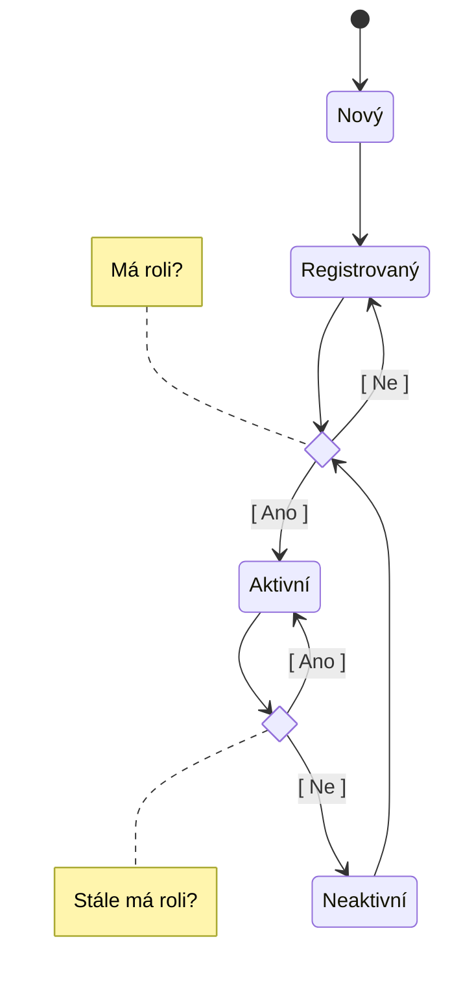

# Admin panel

## Správa uživatelů

### Stavy uživatelského účtu

### Seznam uživatelů

Zobrazené položky:

* Email
* Jméno
* Příjmení
* Přidělené role
* Registrován

Dostupné akce:

* Přidat/pozvat uživatele
* Upravit uživatele
* <s>Odebrat uživatele</s>

### Přidání uživatele

* Unikátnost uživatelů na základě emailu (@gmail?)
* Vstup:
      * Email
      * Jméno
      * Příjmení
* Kontroly:
      * Email: je validní email
      * Jméno: není prázdné
      * Příjmení: není prázdné
* Zpracování:
     * Vyhodnotit kontroly
     * Zkontrolovat, že ještě neexistuje uživatel s daným emailem
           * Pokud existuje, zastavit zpracování a zobrazit chybu
     * Do tabulky `Users` vložit nový záznam se stavem `New`
     * Transakčně uložit změny do DB
     * Přesměrovat přihlášeného uživatele na detail přidaného uživatele

### Úprava uživatele

* Ze seznamu uživatelů přejít na stránku detailu konkrétního uživatele (bude to implementačně snazší, než to dělat v modálním dialogu)
* Needitovatelné položky:
      * Id
      * Email
* Editovatelné položky:
      * Jméno
      * Příjmení
      * Role
* Přiřadit půjdou pouze takové role, které ještě uživatel nemá přiřazeny
* Odebrat půjdou pouze aktuálně přiřazené role
* Kontroly: viz [Přidání uživatele](#pridani-uzivatele)
* Zpracování:
      * Vyhodnotit kontroly
      * Pro všechny **změněné** hodnoty (Jméno, příjmení, role)
          * Vytvořit nový záznam v `UsersAudit`
          * Změnit hodnotu            
       * Vyhodnotit nový stav účtu:
          * Pokud je stávající stav `Registered` nebo `Inactive` a účet má alespoň jednu roli:
            * Vytvořit nový záznam v `UsersAudit`
            * Nastavit stav na `Active`
          * Pokud je stávající stav `Active` a účet nemá žádnou roli:
            * Vytvořit nový záznam v `UsersAudit`
            * Nastavit stav na `Inactive`
      * Transakčně uložit změny do DB
      * Přesměrovat přihlášeného uživatele na seznam uživatelů