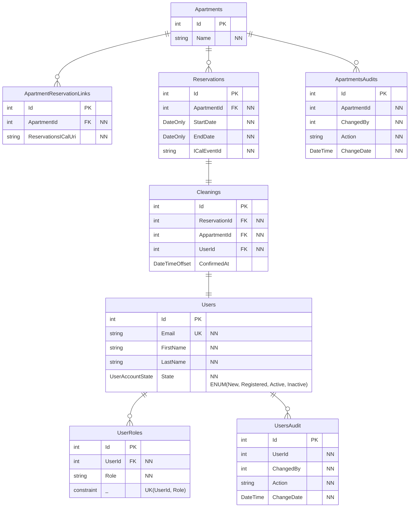

# Databáze

Pro správu DB je použit EF Core.

DB provider je PostgreSQL.

## DB Schéma

(schéma entit, EF Core má ve správě celou DB)

```mermaid
erDiagram

Users {
    int Id PK
    string Email UK "NN"
    string FirstName "NN"
    string LastName "NN"
    UserAccountState State "NN <br/> ENUM(New, Registered, Active, Inactive)"
}

UserRoles {
    int Id PK
    int UserId FK "NN"
    string Role "NN"
    constraint _ "UK(UserId, Role)"
}

Users ||--o{ UserRoles : ""

UsersAudit {
    int Id PK
    int UserId "NN"
    int ChangedBy "NN"
    string Action "NN"
    DateTime ChangeDate "NN"
}

Users ||--o{ UsersAudit : ""

Apartments {
    int Id PK
    string Name "NN"
}

ApartmentReservationLinks {
    int Id PK
    int ApartmentId FK "NN"
    string ReservationsICalUri "NN"
}

Reservations {
    int Id PK
    int ApartmentId FK "NN"
    DateOnly StartDate "NN"
    DateOnly EndDate "NN"
    string ICalEventId "NN"
}

Cleanings {
    int Id PK
    int ReservationId FK "NN"
    int AppartmentId FK "NN"
    int UserId FK "NN"
    DateTimeOffset ConfirmedAt
}

ApartmentsAudits {
    int Id PK
    int ApartmentId "NN"
    int ChangedBy "NN"
    string Action "NN"
    DateTime ChangeDate "NN"
}

Apartments ||--o{ Reservations : ""
Apartments ||--o{ ApartmentsAudits : ""
Apartments ||--o{ ApartmentReservationLinks: ""
Reservations ||--|| Cleanings : ""
Cleanings ||--|| Users : ""
```